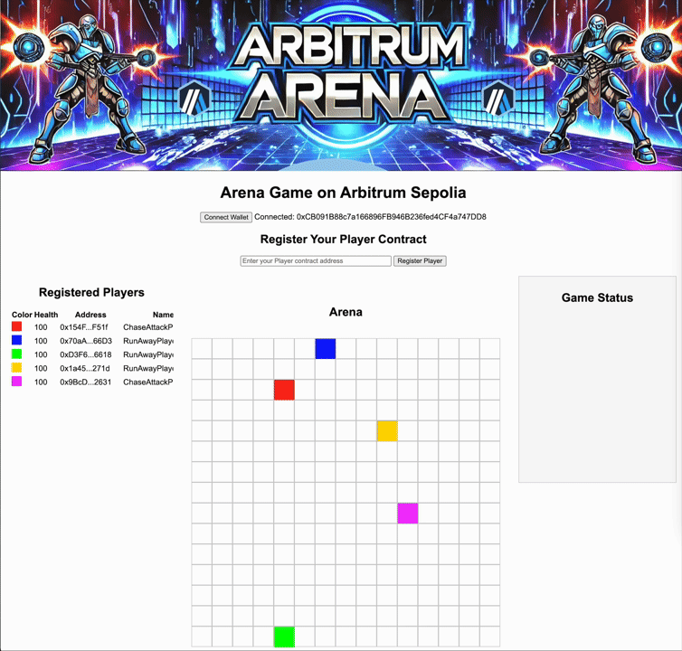

# Arbitrum Arena

Arbitrum Arena is a decentralized, blockchain-based multiplayer game deployed on the Arbitrum Sepolia test network. Players compete against each other on a digital grid-based battlefield, where they can attack, defend, and strategize to outlast their opponents. The game leverages smart contracts written in Solidity to ensure fairness, transparency, and immutability of game mechanics.

## Table of Contents
- [TL;DR](#tl-dr)
- [Overview](#overview)
- [How to Play](#how-to-play)
- [Game Rules](#game-rules)
- [Smart Contract Architecture](#smart-contract-architecture)
- [Getting Started](#getting-started)
- [Contributing](#contributing)
- [License](#license)

## TL;DR
You write a smart contract that controls your player in the arena. Each turn your contract is called with the game state, calculates your own strategy and returns an action: move, rest, defend or attack. Register that contract with the main arena contract and when the game is run, see how your player performs!

## Overview
Arbitrum Arena is a turn-based strategy game where multiple players battle on a grid. Each player controls a unique character with the goal of eliminating other players through strategic moves and attacks. The game is hosted on the Arbitrum Sepolia network, offering fast and low-cost transactions. Players register their participation through their Ethereum wallets and interact with the game using smart contracts.

## How to Play
1. **Connect your wallet**: Use MetaMask or any compatible Ethereum wallet to connect to the Arbitrum Sepolia network.
2. **Register your player contract**: Enter your player contract address to register as a participant.
3. **Make your moves**: During your turn, choose to move, attack, or defend. Each action affects your player's position and health.
4. **Track the action**: The arena grid and status messages will update in real-time based on players' actions.

## Game Rules
### High-Level Rules
1. **Game Setup**:
   - Players register by connecting their Ethereum wallets and providing their player contract addresses.
   - Upon registration, players are assigned a random position on the grid.
   - Players begin with 100 health points and can perform actions each turn.

2. **Turn-Based Mechanics**:
   - Players take turns sequentially. During each turn, a player can choose to:
     - **Move**: Change their position on the grid.
     - **Attack**: Attempt to attack another player within range.
     - **Defend**: Increase their defense, making it more difficult for others to land successful attacks.

3. **Attacking**:
   - A player can attempt to attack a target player within their range.
   - The success of an attack is determined based on various factors, including the attacker's health and the target's defense.
   - If an attack is successful and not defended, the target's health is reduced.
   - If the attack is defended, the target sustains less or no damage.

4. **Defending**:
   - Players can choose to defend during their turn, increasing their chances of reducing or blocking damage from an incoming attack.
   - A successful defense can prevent damage entirely or mitigate its effects.

5. **Winning the Game**:
   - The game ends when only one player remains with health points greater than zero, or a predetermined number of turns have been completed.
   - The last player standing or the player with the most health at the end of the game is declared the winner.

6. **Player Elimination**:
   - A player is eliminated if their health drops to zero or below.
   - Eliminated players are removed from the arena and cannot participate further in the game.

## Smart Contract Architecture
The Arbitrum Arena game is powered by Solidity smart contracts that manage player interactions, game state, and turn-based mechanics. The contract handles:
- Player registration and assignment of starting positions.
- Turn-based action management, including movement, attacks, and defense.
- Calculation of attack success and the impact of defense mechanisms.
- Real-time updates to the game state, such as player positions and health.

## Getting Started
To play Arbitrum Arena or contribute to its development, follow these steps:

### Prerequisites
- MetaMask or a compatible Ethereum wallet.
- Basic understanding of interacting with smart contracts on Ethereum.
- [Node.js and npm](https://nodejs.org/) (Node.js version >= 12.0.0)
- [Git](https://git-scm.com/)

### Clone the Repository
```bash
git clone https://github.com/hammertoe/ArbitrumArenaGame.git
cd ArbitrumArenaGame
```

## Project Structure

- `contracts/`: Contains the Solidity contracts.
  - `Arena.sol`: The main game contract that manages the game state and player interactions.
  - `PlayerContract.sol`: The abstract contract for player interactions.
  - `GameTypes.sol`: Data structures used in the game.
  - `ChaseAttackPlayer.sol`: An example player that chases and attacks the nearest other player
  - `RunAwayPlayer.sol`: An example player that runs away from the nearest player
- `scripts/`: Contains deployment scripts.
  - `deploy.js`: Script to deploy the contracts to a specified network.
- `hardhat.config.js`: Hardhat configuration file.
- `.env`: Environment variables (not included in the repository).

### 2. Install Dependencies

Navigate to the project directory and install the required npm packages:

```bash
npm install
```

### 3. Set Up Environment Variables

Create a `.env` file in the root of your project directory and add the following environment variables:

```plaintext
PRIVATE_KEY=your_private_key_here
```

- `PRIVATE_KEY`: Your Ethereum account's private key (without the `0x` prefix).

### 4. Compile the Contracts

Compile the Solidity contracts using Hardhat:

```bash
npx hardhat compile
```

### 5. Deploy Contracts

Deploy the contracts to the Arbitrum Sepolia testnet:

```bash
npx hardhat run scripts/deploy.js --network arbitrumSepolia
```

After deploying, you will see the deployed contract addresses in the console output.

### 6. Interacting with the Contracts

You can interact with the deployed contracts using the Hardhat console or by writing additional scripts. For example, to interact with the `Arena` contract using the Hardhat console:

```bash
npx hardhat console --network arbitrumSepolia
```

Then, in the console:

```javascript
const Arena = await ethers.getContractFactory("Arena");
const arena = await Arena.attach("deployed_contract_address");

// Call functions on the contract
```

## Contributing

Contributions are welcome! Please fork the repository and submit a pull request.

## License

This project is licensed under the MIT License.
